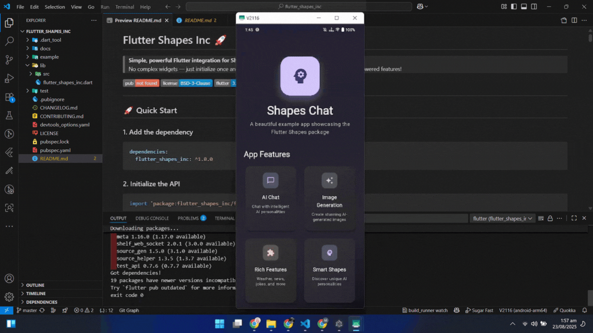

# Flutter Shapes Inc 🚀

> **Simple, powerful Flutter integration for Shapes Inc AI**  
> No complex widgets — just initialize once and call simple functions for chat, multimodal, and AI-powered features!

[](https://pub.dev/packages/flutter_shapes_inc)
[](LICENSE)
[](https://flutter.dev)

---

<div align="center">
  
</div>

## 🚀 Quick Start

### 1. Add the dependency

```yaml
dependencies:
  flutter_shapes_inc: ^1.0.0
```

### 2. Initialize the API

```dart
import 'package:flutter_shapes_inc/flutter_shapes_inc.dart';

void main() {
  // Initialize once with your API key
  ShapesAPI.initialize('your-api-key-here');
  runApp(MyApp());
}
```

### 3. Start chatting

```dart
// Send a simple message
String response = await ShapesAPI.sendMessage('tenshi', 'Hello!');
debugPrint(response);

// Get a shape's profile
ShapeProfile profile = await ShapesAPI.getShapeProfile('tenshi');
debugPrint('Shape name: ${profile.name}');
debugPrint('Avatar: ${profile.avatarUrl}');
```

## 🎨 Enhanced Image Generation

The new image generation system intelligently parses responses and displays images properly:

```dart
// Generate an image
final response = await ShapesAPI.generateImage('tenshi', 'a beautiful cat');

// Extract components automatically
final imageUrls = ShapesAPI.extractImageUrls(response);
final textContent = ShapesAPI.extractTextContent(response);

// Use in your UI
if (imageUrls.isNotEmpty) {
  // Display the actual image (not just the URL!)
  Image.network(imageUrls.first);
  // Show the text response
  Text(textContent);
}
```

### 🔍 Smart Response Parsing

- **Automatic URL Detection**: Identifies image URLs in responses
- **Content Separation**: Splits text content from image URLs
- **Multiple Image Support**: Handles responses with multiple images
- **Shapes API Optimized**: Specifically designed for `files.shapes.inc` URLs

---

## 📚 Complete Function Reference

### 🔤 Basic Chat Functions

```dart
// Send a text message
String response = await ShapesAPI.sendMessage('shape-username', 'Your message');

// Quick chat (simplest way)
String response = await ShapesAPI.quickChat('shape-username', 'Your message');

// Create custom chat completion
String response = await ShapesAPI.createChatCompletion('shape-username', messages);
```

### 🖼️ Multimodal Functions

```dart
// Send message with image
String response = await ShapesAPI.sendImageMessage(
  'shape-username', 
  'Look at this image', 
  'https://example.com/image.jpg'
);

// Send message with audio
String response = await ShapesAPI.sendAudioMessage(
  'shape-username', 
  'Listen to this audio', 
  'https://example.com/audio.mp3'
);

// Send message with multiple images
String response = await ShapesAPI.sendMultiImageMessage(
  'shape-username',
  'Look at these images',
  ['https://example.com/image1.jpg', 'https://example.com/image2.jpg']
);

// Send message with image and audio
String response = await ShapesAPI.sendImageAudioMessage(
  'shape-username',
  'Check this out',
  'https://example.com/image.jpg',
  'https://example.com/audio.mp3'
);

// Generate an image (!imagine)
String generated = await ShapesAPI.generateImage('shape-username', 'a cozy cabin in the woods');
```

### 🛠️ Helper Functions

```dart
// Extract image URLs from multimodal responses
List<String> imageUrls = ShapesAPI.extractImageUrls(response);

// Extract text content from multimodal responses
String textContent = ShapesAPI.extractTextContent(response);

// Example: Process image generation response
final response = await ShapesAPI.generateImage('tenshi', 'a cat');
final images = ShapesAPI.extractImageUrls(response);
final text = ShapesAPI.extractTextContent(response);

// Now you can display the actual images and text separately!
```

### 👤 Shape Information

```dart
// Get shape profile
ShapeProfile profile = await ShapesAPI.getShapeProfile('shape-username');

// Get multiple shape profiles
List<ShapeProfile> profiles = await ShapesAPI.getShapeProfiles(['tenshi', 'einstein']);

// Get popular shapes
List<ShapeProfile> popular = await ShapesAPI.getPopularShapes(limit: 10);
```

### 🔧 Shape Commands

```dart
// Reset shape's memory
String response = await ShapesAPI.resetShape('shape-username');

// Get shape info
String info = await ShapesAPI.getShapeInfo('shape-username');

// Search the web
String result = await ShapesAPI.searchWeb('shape-username', 'search query');

// Get help
String help = await ShapesAPI.getHelp('shape-username');
```

### 🌍 Information & Data

```dart
// Get weather information
String weather = await ShapesAPI.getWeather('shape-username', 'New York');

// Get current time
String time = await ShapesAPI.getCurrentTime('shape-username', 'UTC');

// Get news
String news = await ShapesAPI.getNews('shape-username', 'technology');

// Get stock information
String stock = await ShapesAPI.getStockInfo('shape-username', 'AAPL');

// Get cryptocurrency information
String crypto = await ShapesAPI.getCryptoInfo('shape-username', 'BTC');
```

### 🔤 Language & Translation

```dart
// Translate text
String translation = await ShapesAPI.translate('shape-username', 'Hello world', 'Spanish');

// Get word definition
String definition = await ShapesAPI.define('shape-username', 'serendipity');

// Get synonyms
String synonyms = await ShapesAPI.getSynonyms('shape-username', 'happy');

// Get antonyms
String antonyms = await ShapesAPI.getAntonyms('shape-username', 'happy');
```

### 🧮 Math & Calculations

```dart
// Calculate expression
String result = await ShapesAPI.calculate('shape-username', '2 + 2 * 3');

// Convert units
String conversion = await ShapesAPI.convert('shape-username', '100', 'miles', 'kilometers');
```

### 🎭 Entertainment & Fun

```dart
// Get random joke
String joke = await ShapesAPI.getJoke('shape-username', 'programming');

// Get random quote
String quote = await ShapesAPI.getQuote('shape-username', 'Einstein');

// Get random fact
String fact = await ShapesAPI.getFact('shape-username', 'space');

// Get random trivia
String trivia = await ShapesAPI.getTrivia('shape-username', 'history');
```

### 📺 Media Information

```dart
// Get movie information
String movie = await ShapesAPI.getMovieInfo('shape-username', 'Inception');

// Get book information
String book = await ShapesAPI.getBookInfo('shape-username', '1984');

// Get song information
String song = await ShapesAPI.getSongInfo('shape-username', 'Bohemian Rhapsody');

// Get game information
String game = await ShapesAPI.getGameInfo('shape-username', 'Minecraft');
```

### 🍳 Lifestyle & Health

```dart
// Get recipe
String recipe = await ShapesAPI.getRecipe('shape-username', 'pasta carbonara');

// Get workout plan
String workout = await ShapesAPI.getWorkout('shape-username', 'weight loss');

// Get meditation guidance
String meditation = await ShapesAPI.getMeditation('shape-username', 'mindfulness');

// Get travel recommendations
String travel = await ShapesAPI.getTravelRecommendations('shape-username', 'Paris');
```

### 🎓 Learning & Education

```dart
// Learn language
String language = await ShapesAPI.learnLanguage('shape-username', 'Spanish', '¿Cómo estás?');

// Get coding help
String coding = await ShapesAPI.getCodingHelp('shape-username', 'Python', 'How to sort a list?');

// Get debugging help
String debug = await ShapesAPI.getDebuggingHelp('shape-username', 'NullPointerException');

// Get code review
String review = await ShapesAPI.getCodeReview('shape-username', 'function example() { return true; }');

// Explain algorithm
String algorithm = await ShapesAPI.explainAlgorithm('shape-username', 'quicksort');
```

### ✍️ Writing & Content

```dart
// Get writing help
String writing = await ShapesAPI.getWritingHelp('shape-username', 'This is my essay...', 'academic');

// Check grammar
String grammar = await ShapesAPI.checkGrammar('shape-username', 'I goes to the store');

// Get writing suggestions
String suggestions = await ShapesAPI.getWritingSuggestions('shape-username', 'This is my text...');

// Get design feedback
String design = await ShapesAPI.getDesignFeedback('shape-username', 'I want a modern website design');
```

### 🔧 Utility Functions

```dart
// Initialize with custom settings (recommended for user-facing apps)
ShapesAPI.initialize(
  'your-api-key',
  userId: 'custom-user-id',      // X-User-Id
  channelId: 'session-abc-123',  // X-Channel-Id
);

// Test API connection (fetches a known public profile)
bool ok = (await ShapesAPI.getShapeProfile('tenshi')).enabled;

// Get API usage statistics (mock values)
Map<String, dynamic> stats = await ShapesAPI.getUsageStats();
```

## 🔧 Configuration

### User Identification

```dart
ShapesAPI.initialize(
  'your-api-key',
  userId: 'user123',        // For user identification
  channelId: 'channel456',  // For conversation context
);
```

### Popular Shapes

Try these popular shapes:

- `tenshi` - Cool and casual
- `einstein` - Brilliant scientist
- `socrates` - Wise philosopher
- `shakespeare` - Literary genius
- `da-vinci` - Creative artist

## 📱 Example App

The `example/` app showcases:

- Material 3 + Material You (dynamic color on supported devices)
- Responsive layout with SingleChildScrollView
- Shape search via public profiles (enter username with or without @)
- Username normalization (`@tenshi` → `tenshi`)
- Safe avatar rendering with fallback initials (handles `avatar_url`/`avatar` or none)
- Segmented composer for Text, Image message, Audio message, and `!imagine`
- Proper error handling with user-friendly messages

Run it:

```bash
cd example
flutter pub get
flutter run
```

## 🌐 Web Notes

- On Flutter web, images are rendered via `Image.network(..., errorBuilder: ...)` inside a `ClipOval` to avoid inspector issues.
- Exceptions are thrown as `Exception` types to serialize safely in web devtools.
- If you see an inspector TypeError after a hot restart, perform a full restart.

## 🎯 Features

### 🚀 **Core Capabilities**

- ✅ **50+ Simple API functions** - Cover all AI capabilities
- ✅ **Multimodal support** - Images, audio, and text
- ✅ **Real-time chat** - Send and receive messages
- ✅ **Shape profiles** - Get shape information and avatars

### 🎨 **AI-Powered Features**

- ✅ **Image Generation** - Create stunning AI images with `!imagine`
- ✅ **Smart Content Parsing** - Automatically separate text from images
- ✅ **Multiple Image Support** - Handle responses with multiple images
- ✅ **Enhanced UI Integration** - Images display properly in your app

### 🌍 **Information & Data**

- ✅ **Weather & Time** - Current weather and timezone-aware time
- ✅ **News & Finance** - Latest news, stocks, and cryptocurrency
- ✅ **Language & Translation** - Text translation and word definitions
- ✅ **Math & Conversion** - Calculations and unit conversions

### 🎭 **Entertainment & Learning**

- ✅ **Entertainment** - Jokes, quotes, facts, trivia
- ✅ **Learning tools** - Language learning, coding help, debugging
- ✅ **Lifestyle features** - Recipes, workouts, meditation, travel
- ✅ **Media information** - Movies, books, songs, games

### ✍️ **Writing & Content**

- ✅ **Writing assistance** - Grammar check, suggestions, feedback
- ✅ **Code review** - Programming help and algorithm explanations
- ✅ **Design feedback** - Creative and design assistance

### ⚙️ **Technical Features**

- ✅ **User identification** - Custom user and channel IDs
- ✅ **Error handling** - Proper exception handling
- ✅ **Type safety** - Full Dart type safety
- ✅ **Lightweight** - Minimal dependencies
- ✅ **Web optimized** - Flutter web support with proper error handling

---

## 🚀 That's it

No complex setup, no widgets to configure, just simple functions to integrate Shapes Inc AI into your Flutter app!

```dart
// Initialize once
ShapesAPI.initialize('your-api-key');

// Use any of 50+ functions anywhere in your app
String response = await ShapesAPI.sendMessage('tenshi', 'Hello!');
String weather = await ShapesAPI.getWeather('tenshi', 'London');
```

---

## 📦 Installation

### **Add to pubspec.yaml**

```yaml
dependencies:
  flutter_shapes_inc: ^1.0.0
```

### **Get dependencies**

```bash
flutter pub get
```

### **Import in your code**

```dart
import 'package:flutter_shapes_inc/flutter_shapes_inc.dart';
```

---

## 🔑 Getting Started

### **1. Get your API key**

Visit [Shapes Inc](https://shapes.inc) to get your API key.

### **2. Initialize the API**

```dart
void main() {
  ShapesAPI.initialize('your-api-key-here');
  runApp(MyApp());
}
```

### **3. Start building!**

```dart
// Chat with any shape
String response = await ShapesAPI.sendMessage('tenshi', 'Hello!');

// Generate images
String result = await ShapesAPI.generateImage('tenshi', 'a beautiful sunset');

// Get information
String weather = await ShapesAPI.getWeather('tenshi', 'New York');
```

---

## 🌟 Popular Use Cases

- **Chat Applications** - Build AI-powered chat interfaces
- **Image Generation** - Create AI art and illustrations
- **Information Bots** - Weather, news, and data assistants
- **Learning Tools** - Language learning and educational apps
- **Content Creation** - Writing assistance and creative tools
- **Entertainment** - Joke bots, trivia games, and fun apps

---

## 📚 Documentation

- **📖 [Full Documentation](https://flutter_shapes.ionicerrrrscode.com)** - Complete API reference
- **🎯 [Examples](example/)** - Working example app with Material 3
- **🔧 [API Reference](https://flutter_shapes.ionicerrrrscode.com/#/)** - Detailed function documentation

---

## 🤝 Contributing

We welcome contributions! Please see our [contributing guidelines](CONTRIBUTING.md) for details.

---

## 📄 License

This project is licensed under the BSD 3-Clause License - see the [LICENSE](LICENSE) file for details.

---

## 🙏 Acknowledgments

- **Shapes Inc** - For providing the amazing AI API
- **Flutter Team** - For the incredible framework
- **Community** - For feedback and contributions

---

<div align="center">

**Made with ❤️ for the Flutter community**

[](https://flutter.dev)
[](https://pub.dev/packages/flutter_shapes_inc)
[](LICENSE)

</div>
